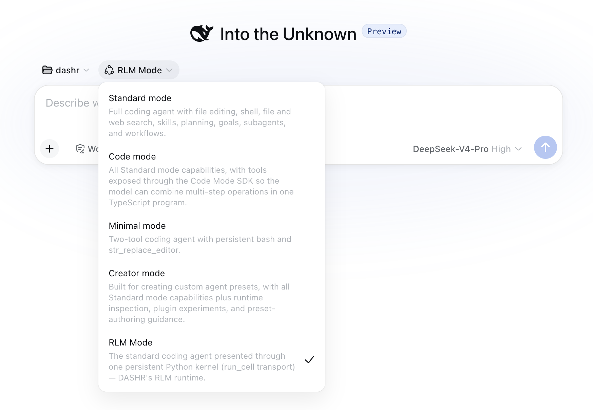

# Dashr: RLM Plugin for `dsh`

<p align="center">
  <a href="https://github.com/fgm-builds/dashr/blob/main/LICENSE"></a>
  <a href="https://github.com/deepseek-ai/deepseek-harness"></a>
  <a href="https://npmjs.com/package/dsh-rlm-mode"></a>
  <a href="https://arxiv.org/abs/2512.24601"></a>
  <a href="https://github.com/fgm-builds/dashr"></a>
</p>

---

## ⚡ Quick Install

```bash
curl -fsSL https://raw.githubusercontent.com/fgm-builds/dashr/main/install.sh | bash
```

### Alternative: `dsh` Plugin CLI (`npm`)

```bash
dsh plugin --profile web add --config.auto-install-peers=false dsh-rlm-mode
# then copy the preset files (install.sh does this for you):
#   <profile>/node_modules/dsh-rlm-mode/preset/rlm-mode/*  →  ~/.dsh/.agent-presets/rlm-mode/
```

> After installation, launch `dsh web` and select the **RLM Mode** agent preset.

---

## 📖 Overview

[DeepSeek Harness (`dsh`)](https://github.com/deepseek-ai/deepseek-harness): Everything is a plugin (Cordis framework).  
[Prime Agent](https://github.com/primeintellect-ai/prime): Context is variable (RLM paradigm).  
**Why not both?** That's `dsh` in RLM mode — that's **Dashr**.

<p align="center">
  
</p>

**Dashr** is an open-source plugin for the [DeepSeek Harness (`dsh`)](https://github.com/deepseek-ai/deepseek-harness) agent runtime. It brings **RLM (Recursive Language Models)** and the **"Context is Variable"** paradigm to `dsh`, registering a dedicated `rlm-mode` agent preset upon installation.

Instead of paying massive token costs on every round-trip tool call in standard multi-turn chat, Dashr equips the agent with a **stateful, persistent Python kernel**. The agent writes self-contained Python programs per cell, manipulating context, tools, and memory as native variables.

---

## 📊 RLM Mode (Dashr) vs. Code Mode (`dsh` built-in)

While both **RLM Mode (Dashr)** and `dsh`'s built-in **Code Mode** provide a code-first interface for programmatic tool orchestration, they differ fundamentally in language ecosystem, kernel persistence, and recursive capabilities:

| Dimension | RLM Mode (Dashr Plugin) | Code Mode (`dsh` Built-in) | Highlight & Advantage |
|---|---|---|---|
| **Interface Standardization** | Host Toolset Registry Schema | Host Toolset Registry Schema | 🤝 Both dynamically expose typed SDK bindings (`tools.*`) generated from the same host registry. |
| **Trigger & Orchestration** | Programmatic Code Execution (Multi-tool script per turn) | Programmatic Code Execution (Multi-tool script per turn) | 🤝 Both collapse multiple sequential tool calls into a single code execution step. |
| **Execution Language** | **Python** (IPython 3.10+) | TypeScript / JavaScript | 🐍 Full access to Python's data science, AST analysis, and AI tooling ecosystem (`pandas`, `numpy`, etc.). |
| **Backend & Kernel Layer** | **Persistent IPython Kernel** (ZeroMQ + Jupyter Protocol) | Ephemeral Node.js Sandbox / One-shot runner | ⚡ Dashr maintains a dedicated, persistent kernel per session. Variables, imports, and objects survive across turns. |
| **Functional Recursive Delegation** | **Native `rlm()` Function Call (Arbitrary Recursion Depth)** | Framework-level Sub-Agent Tool Call | 🔀 Standardized as a zero-friction Python function (`rlm()`). Sub-agents can recursively spawn Level 2+ sub-agents with arbitrary depth, returning results directly into Python variables. |
| **State Snapshot & Revival** | **Full Namespace Snapshot (`dill`)** | Stateless between restarts | 💾 Kernel state can be serialized and restored across session restarts. |

---

## 💡 RLM

Reference: *Recursive Language Models* (MIT/Stanford/Open MIND, 2025, [arXiv:2512.24601](https://arxiv.org/abs/2512.24601))

1. **Context Scaling Up to 100x**:
   250K context LLMs effectively process **10M+ token** inputs beyond physical context windows while avoiding context rot.
2. **Recursive Sub-Agent Task Decomposition** *(not from the reference)*: 
   Recursive sub-agent/sub-task delegation aligns with granular locality and task complexity in open-world settings; delegation and receipt naturally form a doer-verifier pair.
3. **Resilience on Information-Dense Benchmarks**:
   Excels on complex multi-hop reasoning tasks (e.g. *OOLONG-Pairs*), standard frontier LLMs fail catastrophically.
4. **Token & Cost Efficiency**:  
   Outperforms standard long-context ingestion and summarization baselines by up to **2× performance**.


### Architecture

#### 1. Context is Variable (Stateful Kernel)
In standard agent loops, reading large files or computing complex payloads dumps raw output directly into the conversation history. In Dashr:
- State and computation persist inside a live IPython kernel session.
- Intermediate variables survive across cells without re-entering the prompt.
- Tools are exposed as first-class Python functions (`tools.<name>()`). Intermediate execution data never round-trips through the prompt.

#### 2. Recursive Sub-Agents (`rlm()`)
The core mechanism of **Recursive Language Models**:
- For token-heavy or exploratory subtasks, the agent spawns child agents (`handle = rlm("Investigate repository history")`).
- Sub-agents operate recursively in their own isolated context loops.
- When finished, `rlm_await(handle)` collects only the final distilled summary back into the parent kernel.

#### 3. Sliding Context Window
- Even without spawning sub-agents, Dashr maintains a bounded sliding context window over recent turns.
- Prevents context degradation and eliminates context window saturation on long workflows.

#### 4. Compaction & Summarization
- Earlier turns that fall outside the active sliding window are automatically compressed into structured summaries (`compact()`).
- High-level progress, key decisions, and operating guidance are preserved in a dynamic harness (`refine()`) and reinjected into the prompt.

---

## ✨ Features

- 🐍 **Persistent IPython Kernel** — One stateful kernel session per conversation. Variables, imports, and connections persist across cells.
- ⚡ **Dynamic Tool Binding** — Zero hardcoded tool adapters. At startup, Dashr dynamically binds all tools registered in the `dsh` host (`bash`, `web_search`, file operations, workflows, skills, etc.) into type-safe Python SDK functions under `tools.*`.
- 🔀 **In-Kernel Recursive Sub-Agents** — Call `rlm(task)` to spawn parallel sub-agents and `rlm_await(id)` to collect results inside Python code.
- 💬 **A2A Agent Messaging** — Direct agent-to-agent messaging channels across family trees and siblings with result/message separation.
- 🪟 **Global Context Recency Window** — Sliding window compression that preserves recent turns while compacting older history.
- 🧠 **Dynamic Harness & Compaction** — Built-in `refine()` for operating memory and `compact()` for context reduction under pressure.
- 💾 **State Snapshot & Revival** — Save and restore the kernel namespace across sessions.
- 🔄 **Upstream-Proof Preset** — The `rlm-mode` agent preset dynamically includes `dsh`'s standard composition, staying compatible whenever upstream `dsh` introduces new capabilities.

---

## 🔒 Security Model

- **Tool Governance**: Calls to `tools.*` run through `dsh`'s host tool pipeline, where approval and sandbox policies apply normally.
- **Kernel Code Execution**: Python code inside cells executes with the permissions of the local user running `dsh`. Run Dashr in environments where you trust the agent's code execution against your user account (or run `dsh` within a container).

---

## 📚 References & Academic Credit

The design of Dashr builds upon groundbreaking research in recursive agent execution and persistent prompt harnesses:

1. **Recursive Language Models (RLM)**  
   *Recursive Language Models*, 2025.  
   Paper: [arXiv:2512.24601](https://arxiv.org/abs/2512.24601)  
   *Establishes the recursive decomposition and sub-agent execution paradigm for ultra-long context and bounded prompt management.*

2. **Continual Harness & Prompt Refinement**  
   *Continual Harness for Autonomous Agents*, 2026.  
   Paper: [arXiv:2605.09998](https://arxiv.org/abs/2605.09998)  
   *Formulation for dynamic prompt refinement and in-loop compaction.*

---

## 🙏 Acknowledgements & Attribution

Dashr is built as an open-source plugin for [DeepSeek Harness (`dsh`)](https://github.com/deepseek-ai/deepseek-harness).

While Dashr's codebase was developed independently from scratch for the `dsh` plugin ecosystem, the core design and philosophy are deeply inspired by the pioneering work of **[Prime Agent](https://github.com/primeintellect-ai/prime)** by Prime Intellect. We pay tribute to their introduction of the **"Context is Variable"** paradigm and the **Recursive Language Model (RLM)** execution model, which inspired us to bring these breakthrough capabilities to the `dsh` agent community.

### ⚖️ License & Compatibility
Both **Dashr** and upstream inspiration **Prime Agent** are licensed under the permissive **[MIT License](https://opensource.org/licenses/MIT)**. Dashr is fully open-source and license-compliant without IP or licensing conflicts.

---

## 📄 License

This project is licensed under the [MIT License](./LICENSE).
